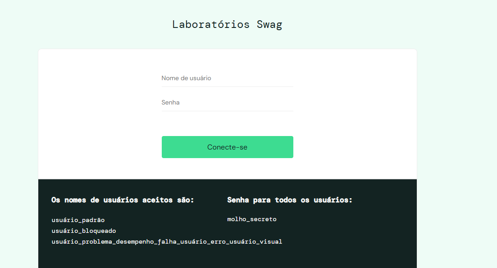

# Portifólio
Esse projeto tem omo finalidade mostrar o meu trabalho de analise de requisitos e plano de teste

Nesse Repositorio voce vai encontar a analise de dois (2) projetos, sendo um:

- Analise de Requisitos de um prototipo Figma
- Plano de Teste de um Site

## Analise de Requisitos

- Protótipo Figma [PodcastApp](https://www.figma.com/design/ECIzSfAWHcPJSi3HxkKdUr/PodcastAppChallenge?node-id=18-5039&p=f&t=h4gJLWaE5X53yNiW-0)

## Portifólio Plano de Teste

- Site utilizado para a elaboração do Plano 

