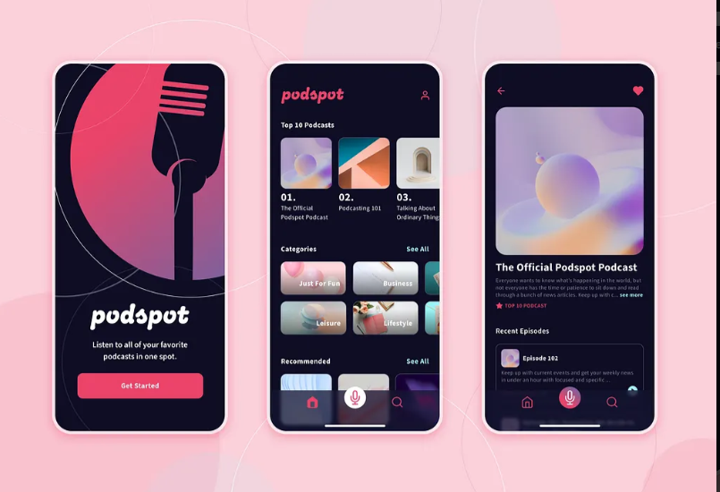

## Projeto Podcast APP

Este projeto foi criado com o propósito  de praticar o **levantamento de requisito**  de um projeto. Onde foi levado em consideração analisar  um projeto do tipo Figma retirado do site UpsLabs onde vários designer tem a possilidade de subir os seus projetos. Com isso irei demonstrar a analise do projeto PodcastA onde através do prótotipo irei analisar os requisitos desejaveis para esse projeto.

## Protótipo
- Protótipo Figma [PodcastApp](https://www.figma.com/design/ECIzSfAWHcPJSi3HxkKdUr/PodcastAppChallenge?node-id=18-5039&p=f&t=h4gJLWaE5X53yNiW-0)

## Anlise do Projeto

A imagem abaixo irá indicar como foi feita a análise deste projeto, onde foi utilizado o **MIRO** para fazer a análise de forma visual

1. Indicação da Imagem a ser analisada
2. Indicação de qual Requerimento iremos analisar, indicando seu numero e nome
3. Descrição em alto nivel da funcionalidade indicando o usuário que irá utilizar, a funcionalidade desejada e o porque da existencia desta funcionalidade.
4. Listagem das regras de negócio a serem implementadas.

